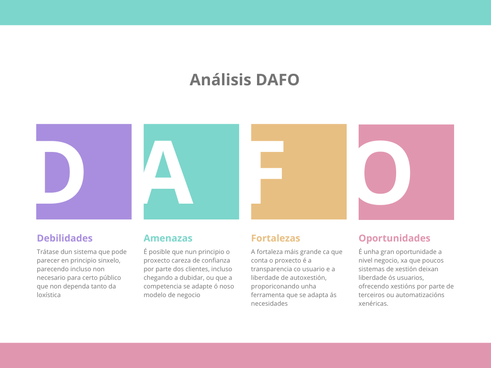

# Anteproxecto fin de ciclo

- [Anteproxecto fin de ciclo](#anteproxecto-fin-de-ciclo)
  - [1- Descrición do proxecto](#1--descrición-do-proxecto)
  - [2- Empresa](#2--empresa)
    - [2.1- Idea de negocio](#21--idea-de-negocio)
    - [2.2- Xustificación da idea](#22--xustificación-da-idea)
    - [2.3- Segmento de clientes](#23--segmento-de-clientes)
    - [2.4- Competencia](#24--competencia)
    - [2.5- Proposta de valor](#25--proposta-de-valor)
    - [2.6- Forma xurídica](#26--forma-xurídica)
    - [2.7- Investimentos](#27--investimentos)
      - [2.7.1- Custos](#271--custos)
      - [2.7.2- Ingresos](#272--ingresos)
    - [2.8- Viabilidade](#28--viabilidade)
      - [2.8.1- Viabilidade técnica](#281--viabilidade-técnica)
      - [2.8.2 - Viabilidade económica](#282---viabilidade-económica)
      - [2.8.3- Conclusión](#283--conclusión)
  - [3- Requirimentos técnicos](#3--requirimentos-técnicos)
  - [4- Planificación](#4--planificación)

## 1- Descrición do proxecto

> O proxecto consiste no desenvolvemento dun sistema de xestión de entregas, principalmente enfocado en pequenos negocios, que necesiten unha orientación rápida e interactiva do tempo e distancia que lles levará realizar unha entrega. A aplicación permitirá visualizar as entregas pendentes de asignar, tendo cada entrega unha ubicación, que será o destino da ruta, así coma as realizadas, ca información correspondente.
>
> Para conseguir que sexa máis visual, a web contará cun mapa interactivo, no que mostrará a ruta.
>
> O propósito principal é optimizar o proceso de entrega, reducindo tempos e mellorando a transparencia. O principal obxectivo é buscar unha interfaz rápida e sinxela para que as pequenas empresas poidan xestionar de forma interactiva as rutas de transporte, podendo ter así o seguimento e xestión das mesmas.
>
> Como oportunidade de negocio, ten o atractivo de que é unha ferramenta sinxela pero eficaz á hora de mellorar a loxística da empresa. Comercializándose mediante un modelo de suscripción.

## 2- Empresa

> ** TODO **

### 2.1- Idea de negocio

> O producto central trátase dunha aplicación web que permite aos seus usuarios ter unha xestión directa, interactiva e sinxela das rutas das entregas que necesiten. Para conseguir facer viable dito proxecto, comercializarase cun formato de suscripción único, de 40€ / mensuais sen restriccións.
>
> No futuro sería posible implementar novas funcionalidades, de feito que, por exemplo, as rutas poidan ser programadas automáticamente, reducindo a labor manual.

### 2.2- Xustificación da idea

> Como xa se mencionou anteriormente, a idea e fomentar e mellorar o funcionamento das pequenas empresas a nivel loxístico, consiguendo que sexan menos dependentes das grandes corporacións. A idea foi acadada debido á incapacidade (moitas veces económica) de moitos negocios de non poder xestionar de forma autónoma nunha mesma interfaz.
>
> Como resumo:
>
> - A idea pretende mellorar enormemente a loxística de moitas empresas e/ou usuarios.
> - Existen ferramentas que tratan este tema, como se trata posteriormente, pero sempre cuns custos moi altos ou xestionando eles as entregas.
> - A loxística é un dos problemas e sectores máis importantes, máis nunha época donde se premia a inmediatez e a transparencia.
>
> Coma enlaces a datos de posible xustificación, atoparíamos tales coma un artículo de , reflexando un estudo de Geopost sobre a importancia en España de mellorar o ámbito de transporte e loxística das PYMES.
>
> Outro informe interesante sería o de  no que resumen o informe de "Digitalización de las pymes españolas" do Banco Europeo de Inversiones, reflexando que o sector do transporte é retincente a cambios dixitais debido ó descoñecemento e o medo económico, cousa que o noso proxecto busca solventar, sendo transparente e sinxelo.
>
> Ademáis dos datos do propio sector, 
>
> A continuación mostrase un gráfico DAFO, resumindo as debilidades e fortalezas da idea de negocio.
>
> 

### 2.3- Segmento de clientes

> O público obxectivo son grupos concretos:
>
> - Pequenos negocios que teñan servizo de entrega ou se queiran expandir nese ámbito.
> - Autónomos que necesiten facer entregas de forma constante ou recurrente.
> - Empresas locais que precisan organizar rutas de reparto.

### 2.4- Competencia

> Existen solucións coma Glovo, indiscutiblemente a máis coñecida, pero eles xestionan o reparto e levan unha comisión, además de estar máis orientados no consumidor e non na propia empresa. Tamén existe Logístiko, que proporciona unha interfaz moi boa, e grandes funcionalidades pero segue sen estar orientadas a pequenos negocios, pois o precio parte de 200€/mes.

### 2.5- Proposta de valor

> O servizo que se ofrece é totalmente flexible e independente do negocio a realizar ou o tipo de entrega. Ademáis ofrece unha capacidade total de organización xa que aporta a información necesaria ofrecendo a posibilidade de xestionala de forma manual e precisa.

### 2.6- Forma xurídica

> A forma xurídica será a de autónomo, xa que a Cooperativa é inviable ó ser únicamente unha persoa e a Sociedade Limitada oriéntase máis a actividades empresariais.

### 2.7- Investimentos

> Como concepto inicial de gastos, necesitaríanse:
> - Alquiler dunha oficina: 300€ / mes -> 3600€ / anuales
> - Internet: 100€ / mes -> 1200€ / anuales
> - Ordenador: 800€
> - Servicio de hosting: plan medio de SiteGround, 5.50€ / mes -> 66€ / anuales

#### 2.7.1- Custos

> ** TODO **

#### 2.7.2- Ingresos

> Dado o precio da suscripción, de 30€ / mensuales, estímase no primeiro ano poder chegar a 20 suscripcións mensuais fixas, dando un ingreso bruto de 600€ / mensuales. A partir de ahí, ca confianza posta no producto, estímase chegar ás 50 suscripcións mensuais fixas, mantendo uns ingresos brutos de 1500€ / mensuales. O obxetivo é acadar as 100 suscripcións mensuais.

### 2.8- Viabilidade

#### 2.8.1- Viabilidade técnica

> Dende o punto de vista técnico, é completamente viable a idea, debido a que, non haberá falta de recursos e requírese de relativamente pouca infraestructura, que quedaría acadada nos investimentos realizados. A nivel hosting ou desenrolo, non habería problema pois a plataforma de hosting é fiable e os coñecementos técnicos serán correctamente empregados para unha aplicación de calidade.

#### 2.8.2 - Viabilidade económica

> ** TODO **

#### 2.8.3- Conclusión

> ** TODO **

## 3- Requirimentos técnicos

> - **Infraestructura:** empregarase un servidor web XAMPP, para ter un entorno de traballo eficaz, proporcionando o servidor Apache e MySQl
> - **Backend:** para o backend empregarase o lenguaxe de PHP, xa que é un lenguaxe moi axeitado pola súa efectividade para traballar no entorno web.
> - **Frontend:** para o frontend empregarase HTML5, CSS e JavaScript con Leaflet, que é a librería que nos permitirá ter o mapa interactivo.

> Este apartado podería cambiar á hora do emprego de PHP base ou o framework Laravel.

## 4- Planificación

> A planificación é, en principio, sinxela de seguir, tendo en conta unha estimación xeral, o proxecto estará formado polas seguintes fases, estando sempre aberto a pequenos cambios segundo sexa necesario:
>
| Fase                | Data de inicio | Duración | Descrición |
|---------------------|---------------|----------|------------|
| Estudo preliminar  | 01/04/2025     | 1 semana | Análise do mercado e necesidades que vai cubrir o proxecto. |
| Deseño             | 07/04/2025     | 2 semanas | Creación do deseño da interfaz con Figma. |
| Desenvolvemento    | 21/04/2025     | 6 semanas | Desenrolo do código e da estructura do proxecto |
| Probas         | 02/06/2025     | 1 semanas | Realizar as tarefas de testeo e optimización |

[**<-Anterior**](../README.md)
