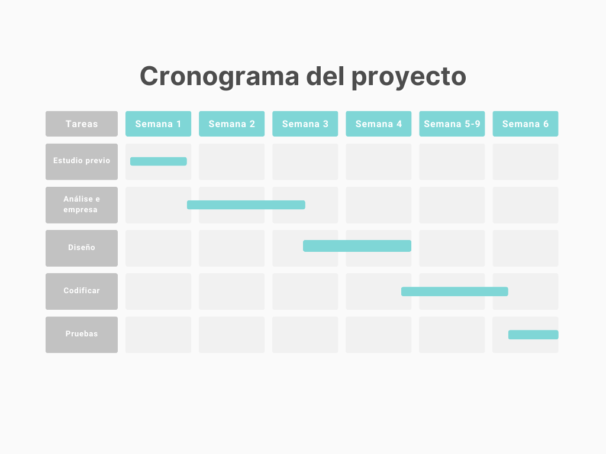

# Anteproxecto fin de ciclo

- [Anteproxecto fin de ciclo](#anteproxecto-fin-de-ciclo)
  - [1- Descrición do proxecto](#1--descrición-do-proxecto)
  - [2- Empresa](#2--empresa)
    - [2.1- Idea de negocio](#21--idea-de-negocio)
    - [2.2- Xustificación da idea](#22--xustificación-da-idea)
    - [2.3- Segmento de clientes](#23--segmento-de-clientes)
    - [2.4- Competencia](#24--competencia)
    - [2.5- Proposta de valor](#25--proposta-de-valor)
    - [2.6- Forma xurídica](#26--forma-xurídica)
    - [2.7- Investimentos](#27--investimentos)
      - [2.7.1- Custos](#271--custos)
      - [2.7.2- Ingresos](#272--ingresos)
    - [2.8- Viabilidade](#28--viabilidade)
      - [2.8.1- Viabilidade técnica](#281--viabilidade-técnica)
      - [2.8.2 - Viabilidade económica](#282---viabilidade-económica)
      - [2.8.3- Conclusión](#283--conclusión)
  - [3- Requirimentos técnicos](#3--requirimentos-técnicos)
  - [4- Planificación](#4--planificación)

## 1- Descrición do proxecto

O proxecto consiste no desenvolvemento dunha plataforma web chamada **Routigal**, enfocada en profesionais, pequenas empresas e comerciais que realizan servizos ou visitas a domicilio. O obxectivo principal é permitirlles planificar rutas de forma eficiente e interactiva, visualizando nun mapa os puntos de destino, tempos estimados (tanto de chegada ó destino coma de salida) e distancia total do desprazamento, permitindo así tamén estimar o custo do desplazamento.

Cada servizo pendente terá un destino, un final e unha ou varias ubicacións asignadas, puidendo ser ordenadas manualmente segundo interese, por exemplo, tendo en conta os horarios dos locais en caso de comerciais ou de conveniencia de clientes en caso de servizos. A aplicación ofrecerá ademais un sistema de comunicación da hora estimada automaticamente ao cliente.

A ferramenta busca ser sinxela, clara e eficaz, permitindo reducir tempos mortos, optimizar recursos e mellorar a experiencia tanto do profesional coma do cliente. 

O modelo de negocio baséase nunha suscrición mensual, ofrecendo unha alternativa económica e funcional fronte a solucións máis complexas e caras, ademáis de ser completamente autónoma en canto a xestión, é decir, é unha plataforma dedicada exclusivamente ás necesidades do usuario.

## 2- Empresa

### 2.1- Idea de negocio

O producto central trátase dunha aplicación web que permite aos seus usuarios ter unha xestión directa, interactiva e sinxela das rutas que necesiten en base ós traballos ou visitas por realizar. Para conseguir facer viable dito proxecto, comercializarase cun formato de suscripción único, de 30€ / mensuais sen restriccións.

No futuro sería posible implementar novas funcionalidades, de feito que, por exemplo, as rutas poidan ser programadas automáticamente, reducindo a labor manual, ou actualice automáticamente ao cliente de posibles cambios de horario.

### 2.2- Xustificación da idea

A idea naceu pola observación de que moitos profesionais, comerciais e pequenos negocios carecen dunha ferramenta lixeira e sinxela para organizar os seus desprazamentos. A maioría improvisan sobre a marcha ou usan aplicacións non específicas como Google Maps, o que fai que perdan tempo e eficiencia, ademáis de ter que contrastar a información nunha ferramenta externa.

Routigal pretende cubrir esa necesidade ou carenica con algo claro, útil e adaptado ó día a día dos traballadores. Ademais, tamén busca facilitar a comunicación cos clientes mediante avisos automáticos dos horarios estimados.

É aplicable tanto a técnicos (electricistas, fontaneiros, instaladores...) como a comerciais que fan visitas a clientes por zonas.

En resumo:

- Aporta organización e control a pequenos negocios, autónomos e comerciais.
- Alternativa máis económica e simple fronte a solucións orientadas a grandes empresas.
- Potencial de mercado alto, xa que moitas empresas aínda traballan sen ferramentas específicas.

Coma enlaces a datos de posible xustificación, atoparíamos tales coma un artículo de [Logística Profesional](https://www.logisticaprofesional.com/texto-diario/mostrar/5102750/85-pymes-espana-senala-servicios-entrega-como-esenciales-competitividad?utm_source=chatgpt.com), reflexando un estudo de Geopost sobre a importancia en España de mellorar o ámbito de transporte e loxística das PYMES.

Outro informe interesante sería o de [Transporte Profesional](https://transporteprofesional.es/noticias-actualidad-transporte-logistica/transporte-de-mercancias/por-que-las-pymes-son-reticentes-a-la-digitalizacion) no que resumen o informe de "Digitalización de las pymes españolas" do Banco Europeo de Inversiones, reflexando que o sector do transporte é retincente a cambios dixitais debido ó descoñecemento e o medo económico, cousa que o noso proxecto busca solventar, sendo transparente e sinxelo.

Ademáis destes datos, que demostran unha falta de investimento na loxística, aínda que sexa no sector de transporte, representa unha necesidade de organización nos eventos que requiran desprazamentos asiduos, xa que para calqueira empresa, a organización é primordial, debido os custos engadidos por imprevistos ou a falta de optimización do tempo.

A continuación mostrase un gráfico DAFO, resumindo as debilidades e fortalezas da idea de negocio.

### 2.3- Segmento de clientes

O público obxectivo son grupos concretos:

- Pequenos negocios que realicen servizos a domicilio ou se queiran expandir nese ámbito.
- Empresas que precisan organizar rutas de servizo para os seus técnicos.
- Comerciais que precisan chegar ó maior número de localizacións no dia, e calcular ben os tempos.

### 2.4- Competencia

Existen ferramentas como RouteXL e OptimoRoute, que poden ser alternativas claramente competitivas, xa que ofrecen un funcionamento similar.

O importante na diferencia de *Routigal* é a simpleza, buscamos que calqueira usuario poida desde o primeiro minuto adaptarse á nosa usabilidade e empezar a traballar coa nosa interface. Ademáis, non dispoñemos de variabilidade nos precios, é un precio único de 25€ / mes por cliente, sin límite de paradas como RouteXL ou custo a maiores por usuario coma OptimoRoute.

Ademáis, OptimoRoute, sendo principal competidor de servizo, non conta cunha interface en castelán e RouteXL ofrece servizos con peticións limitadas.

### 2.5- Proposta de valor

O servizo que se ofrece é totalmente flexible e independente do negocio a realizar ou o tipo de servizo. Ademáis ofrece unha capacidade total de organización de forma sinxela, visual e eficaz, xa que aporta a información necesaria ofrecendo a posibilidade de xestionala de forma manual e precisa.

### 2.6- Forma xurídica

A forma xurídica será a de autónomo, xa que é máis viable e sinxela de forma inicial para lanzar o producto dado os baixos custos de investimento iniciais, e acadar visualización no mercado, para posteriormente se os resultados son óptimos transicionar a Sociedade Limitada Unipersonal, para acadar maior capacidade de expansión, investimentos e protección fiscal.

Ademáis da falta de capital para considerar o cambio a SL ou SLu. A idea é aproveitarse de axudas que se ofrecen ó autónomo como por exemplo:
- [TR341D - Promoción del Empleo Autónomo de las personas trabajadoras autónomas - 2025](https://oficinadoautonomo.gal/es/portfolio/6117)
- [Subvenciones para apoyar iniciativas de emprendimiento - 2025](https://oficinadoautonomo.gal/es/portfolio/6235)

### 2.7- Investimentos

Como concepto inicial de gastos, necesitaríanse, no primeiro ano:

- Aluguer dunha oficina: 400€ / mes -> 4800€ / anuais.
- Internet: 30€ / mes -> 360€ / anuales
- Ordenador: 800€ (pago único)
- Servicio de hosting: plan medio de SiteGround, 5.50€ / mes -> 66€ / anuales
- Mobiliario de oficina: 600€ (pago único)

É dicir, teríamos unha inversión inicial de 6,626 €.

#### 2.7.1- Custos

Os custos fixos anuais serían:

- Aluguer: 4800€.
- Internet: 180€ (finetwork).
- Servicio de hosting: plan medio de SiteGround -> 66€.
- Servizos (luz, auga...): 1,200€.
- Dominio: 60€.

É dicir os custos fixos anuais serían:
- 7,206€.

Os custos variables serían:

- Nómina: 17,000€, sendo variable segundo o beneficio xerado. 
- Cota de autónomo (con bonificación): 0€ primeiro ano pola "cota cero" da Xunta / 960€ segundo ano (prórroga da tarifa plana) / 3,600€ terceiro ano (estimación).
- Custos de pasarela de pago (Stripe): 3% do valor de venda. Unha previsión posible sería:
    1ª ano: 540€.
    2º ano: 900€.
    3º ano: 1,440€.
- IRPF: pola reducción de autónomos, é dun 7% os primeiros 3 anos.
- IVA: 21%.
- Imprevistos: 1,000€.
- Posibles desprazamentos: 500€.
- Publicidade: 600€, variando segundo beneficios.

É dicir os custos variables anuais serían, de forma estimada:
- Primeiro ano: 19,640€
- Segundo ano: 20,960€
- Terceiro ano: 24,140€

Gasto total anual:
- Primeiro ano: 26,846€
- Segundo ano: 28,166€
- Terceiro ano: 31,346€

#### 2.7.2- Ingresos

O precio da aplicación será de tipo subscripción, 25€ con IVA / mensuais.

A continuación realizo unha previsión, na miña opinión conservadora, dado que únicamente en Galicia existen máis de 225,000 autónomos, moitos deles destinados a servizos a domicilio.

- **Primeiro ano**: é o máis complicado de estimar, se estimamos de forma conservadora, poderíamos falar de 60 clientes sostidos, xerando mensualmente 1,500€, é decir, 18,000€ anuais.

- **Segundo ano**: aquí falaríamos de tentar acadar estables os 100 usuarios fixos, xerando un aproximado mensual de 2,500€, é decir, 30,000€ anuais.

- **Terceiro ano**: dada a confianza obtida, e a publicidade, o obxectivo é acadar os 160 usuarios fixos, xerando mensualmente de forma sostida 4,000€, é decir, 48,000€ anuais.

### 2.8- Viabilidade

#### 2.8.1- Viabilidade técnica

O desenvolvemento e xestión técnica do proxecto é viable debido a que:

- As tecnoloxías empregadas, coma PHP e JavaScript están máis que probadas para todo tipo de proxectos web, ofrecendo unha moi boa sinxerxia e rapidez.
- A librería de Leaflet permite proporcionar ó usuario un medio de interacción coas rutas e/ou ubicacións que necesite xestionar, á vez que tamén é unha tecnoloxía empregada en diversos proxectos, por exemplo Zumper, que é unha plataforma de aluguer de vivendas.
- A infraestructura empregada, que será o servicio hosting de SiteGround, é máis que capaz de soportar o tráfico estimado, e, de ser necesario, poderíase aumentar de forma moi sinxela a capacidade, cun plan máis profesional.

#### 2.8.2 - Viabilidade económica

Para calcular a viabilidade económica vamos realizar uns cálculos sinxelos:

**Primeiro ano**:

- Ingresos: 18,000e / 1.21 (Desconto do IVA sobre a base) = 14,876€
- Gastos totais: 26,846€
- Balance anual: 14,876€ - 26,846€ = -11,970€

**Segundo ano**:

- Ingresos: 30,000€ / 1.21 (Desconto do IVA sobre a base) = 24,793€
- Gastos totais: 28,166€
- BAI: 24,793€ - 28,166€ = -3,373€

**Terceiro ano**:

- Ingresos: 48,000€ / 1.21 (Desconto do IVA sobre a base) = 39,670€
- Gastos totais: 31,346€
- BAI: 39,670€ - 31,346€ = 8,124€
- Beneficio neto: 8,124€ - 7% = 7,555€

Con estos datos podemos chegar á conclusión de que os dous primeiros anos estaríamos nunha situación complicada, que poderíamos solventar cun préstamo no primeiro ano de 20,000€ de ser necesario, fácilmente amortizable a partir do terceiro ano, dados os datos aportados. 

Pero, a partir do terceiro ano, os beneficios do exercicio serían moito máis prometedores, xa que o salario continuaría sendo o mínimo, teríamos aínda 7,555€ de beneficio neto de marxen, para poder paliar o préstamo e a inversión inicial e buscar novos investementos ou, de querer, aumentar o salario.

#### 2.8.3- Conclusión

A idea é viable a nivel técnico e, potencialmente económico. Aporta valor real e resolve unha necesidade existente. Cunha boa presentación, ten capacidade de consolidarse como ferramenta útil e diferencial para un nicho de mercado no que a dixitalización todavía non é algo extenso. Ademáis, non resolve únicamente un problema, senón que o fai dunha forma sinxela, adaptable e cómoda.

## 3- Requirimentos técnicos

- **Infraestructura:** empregarase un servidor de hosting do proveedor SiteGround para a posta en producción é despgregue.
- **Backend:** para o backend empregarase o lenguaxe de PHP, xa que é un lenguaxe moi axeitado pola súa efectividade para traballar no entorno web. Para o almacenamento de datos empregarse MySQL.
- **Frontend:** para o frontend empregarase HTML5, CSS e JavaScript con Leaflet, que é a librería que nos permitirá ter o mapa interactivo, e SweetAlert para ter unhas alertas coidadas e mellorar a experiencia do usuario.

## 4- Planificación

A planificación é, en principio, sinxela de seguir, tendo en conta unha estimación xeral, o proxecto estará formado polas seguintes fases, estando sempre aberto a pequenos cambios segundo sexa necesario:

[**<-Anterior**](../../../README.md)
