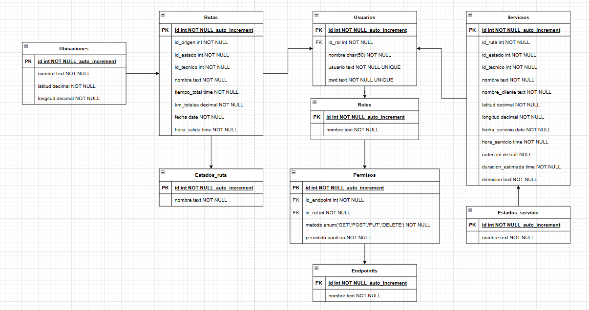

# FASE DE DESEÑO

- [FASE DE DESEÑO](#fase-de-deseño)
  - [1- Diagrama da arquitectura](#1--diagrama-da-arquitectura)
  - [2- Casos de uso](#2--casos-de-uso)
  - [3- Diagrama de Base de Datos](#3--diagrama-de-base-de-datos)
  - [4- Deseño de interface de usuarios](#4--deseño-de-interface-de-usuarios)

## 1- Diagrama da arquitectura

Diagrama básico de arquitectura para contextualizar el contexto técnico de la aplicación.

## 2- Casos de uso

Casos de uso generalizados, siendo el administrador un rol tomado por un autónomo en caso de ser único trabajador o el adminsitrador de una empresa que gestione los técnicos y servicios.

## 3- Diagrama de Base de Datos

Diagramas de la base de datos empleada en el proyecto.

## 4- Deseño de interface de usuarios

Mockup en figma, donde se muestra una idea de diseño para la web.

- Me gustaría aclarar que es un mockup inicial para mostrar la idea y el diseño básico, no es definitivo y quiero añadir más cosas.

[**<-Anterior**](../../README.md)
